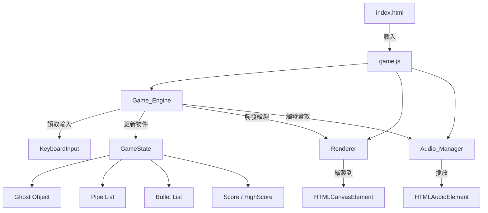
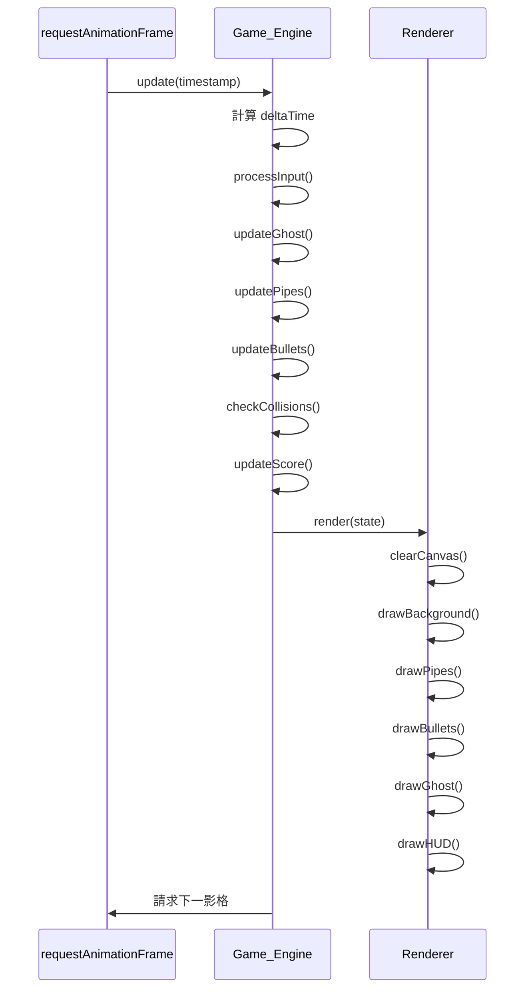

# Design Document: Kiro Ghost Shooter

## Overview

Kiro Ghost Shooter 是一款以純前端技術實作的橫向捲軸射擊遊戲，靈感源自 Flappy Bird。玩家操控一隻幽靈（ghosty），在持續生成的上下水管障礙物之間穿梭，並可發射八方向子彈破壞水管。遊戲速度隨時間遞增，計分板記錄當局分數與歷史最高分。

### 技術選擇

- **平台**：HTML5 Canvas API + 原生 JavaScript（ES2020+）
- **無框架、無遊戲引擎**：所有遊戲邏輯自行實作
- **檔案結構**：最多三個原始碼檔案（`index.html`、`game.js`、`style.css`）
- **資源**：`assets/ghosty.png`（精靈圖）、`assets/jump.wav`、`assets/game_over.wav`

### 設計目標

1. 將遊戲邏輯清楚地劃分為 **Game_Engine**、**Renderer**、**Audio_Manager** 三個職責模組
2. 以 `requestAnimationFrame` 驅動主迴圈，目標幀率 30–60 FPS
3. 碰撞偵測採用軸對齊邊界框（AABB）為主、圓形碰撞為輔（破損區域）
4. 所有狀態集中管理，方便 Game Over 後完整重置

---

## Architecture

遊戲採用單一 HTML 頁面架構，所有邏輯集中於 `game.js`。三個模組以物件字面值（object literal）形式定義，透過明確的函式呼叫互動，不使用全域副作用。



### 主迴圈流程



### 攝影機捲動模型

幽靈在世界座標（world space）中持續向右移動（+3 px/frame），但渲染時固定於畫面左側約 1/3 處（screen X ≈ canvas.width / 3）。水管和子彈以世界座標計算位置，渲染時減去攝影機偏移量（`cameraX = ghost.worldX - canvas.width / 3`）轉換為畫面座標。

---

## Components and Interfaces

### Game_Engine

負責主迴圈、物理更新、碰撞偵測、狀態管理。

```javascript
const GameEngine = {
  // 初始化遊戲
  init(canvas, audioManager, renderer): void,

  // 每幀更新（由 requestAnimationFrame 呼叫）
  update(timestamp): void,

  // 重置所有遊戲狀態
  reset(): void,

  // 觸發 Game Over 流程
  triggerGameOver(): void,

  // 內部：更新幽靈物理
  _updateGhost(dt): void,

  // 內部：更新水管列表
  _updatePipes(dt): void,

  // 內部：更新子彈列表
  _updateBullets(dt): void,

  // 內部：碰撞偵測
  _checkCollisions(): void,

  // 內部：計分邏輯
  _updateScore(): void,

  // 內部：速度加速計時器
  _updateSpeed(dt): void,
};
```

### Renderer

負責將所有遊戲物件繪製到 Canvas。

```javascript
const Renderer = {
  // 初始化（取得 canvas context）
  init(canvas): void,

  // 主繪製入口
  render(state): void,

  // 繪製背景（#87CEEB）
  _drawBackground(): void,

  // 繪製水管（含破損區域與閃爍效果）
  _drawPipes(pipes, cameraX): void,

  // 繪製子彈
  _drawBullets(bullets, cameraX): void,

  // 繪製幽靈（含無敵閃爍）
  _drawGhost(ghost, cameraX): void,

  // 繪製 HUD（血量、分數）
  _drawHUD(hp, score, highScore): void,

  // 繪製 Game Over 畫面
  _drawGameOver(score): void,
};
```

### Audio_Manager

負責音效的載入與播放，所有錯誤靜默處理。

```javascript
const AudioManager = {
  // 初始化並預載音效
  init(): void,

  // 播放跳躍音效（如正在播放則重頭播放）
  playJump(): void,

  // 播放 Game Over 音效
  playGameOver(): void,
};
```

### KeyboardInput

追蹤按鍵狀態，提供事件驅動的輸入介面。

```javascript
const KeyboardInput = {
  // 初始化 keydown / keyup 監聽器
  init(): void,

  // 查詢某鍵是否正被按住
  isDown(key): boolean,

  // 消費一次性按鍵事件（用於發射子彈、重新開始等）
  consumePressed(key): boolean,
};
```

---

## Data Models

### GameState

```javascript
const state = {
  // 遊戲模式: 'playing' | 'gameover'
  mode: 'playing',

  // 攝影機世界 X 偏移量
  cameraX: 0,

  // 幽靈
  ghost: {
    worldX: 0,       // 世界座標 X（累計移動距離）
    screenX: 0,      // 畫面固定位置 ≈ canvas.width / 3
    y: 0,            // 畫面 Y 座標
    vy: 0,           // 垂直速度（px/frame）
    width: 40,       // 幽靈寬度（px）—由圖片決定
    height: 40,      // 幽靈高度（px）—由圖片決定
    hp: 3,           // 當前血量
    invincible: false,        // 是否在無敵時間
    invincibleTimer: 0,       // 無敵剩餘時間（ms）
    blinkVisible: true,       // 無敵閃爍可見狀態
    blinkTimer: 0,            // 閃爍計時器（ms）
  },

  // 水管列表
  pipes: [
    /* PipeObject — 見下方 */
  ],

  // 子彈列表
  bullets: [
    /* BulletObject — 見下方 */
  ],

  // 分數
  score: 0,
  highScore: 0,

  // 速度控制
  pipeSpeed: 2,        // 當前水管移動速度（px/frame）
  speedTimer: 0,       // 速度升級計時器（ms）

  // 水管生成計時器
  spawnTimer: 0,       // 距下次生成的剩餘時間（ms）
};
```

### PipeObject

```javascript
const pipe = {
  worldX: 0,          // 水管在世界座標的 X 位置
  width: 60,          // 水管寬度（固定）
  gapCenterY: 0,      // 縫隙中心 Y 座標（畫面座標）
  gapHeight: 150,     // 縫隙高度（固定）
  gapDirection: 1,    // 振盪方向：+1 向下、-1 向上
  hitCount: 0,        // 被子彈命中次數（0–3）
  scored: false,      // 是否已計分
  flashTimer: 0,      // 閃爍剩餘時間（ms）；> 0 時顯示紅色
  brokenZone: null,   // BrokenZone | null
};
```

### BrokenZone

```javascript
const brokenZone = {
  // 破損圓心（相對於水管的本地座標）
  localX: 0,
  localY: 0,
  // 半徑 = 1.5 × ghost.width
  radius: 60,
};
```

### BulletObject

```javascript
const bullet = {
  worldX: 0,    // 世界座標 X
  y: 0,         // 畫面 Y
  vx: 0,        // X 速度分量（px/frame）
  vy: 0,        // Y 速度分量（px/frame）
  radius: 4,    // 子彈半徑（px）
};
```

### 八方向速度向量表

| 方向    | 角度  | vx                  | vy                  |
|---------|-------|---------------------|---------------------|
| 右      | 0°    | +8                  | 0                   |
| 右下    | 45°   | +8 × cos45 ≈ +5.66  | +8 × sin45 ≈ +5.66  |
| 下      | 90°   | 0                   | +8                  |
| 左下    | 135°  | −5.66               | +5.66               |
| 左      | 180°  | −8                  | 0                   |
| 左上    | 225°  | −5.66               | −5.66               |
| 上      | 270°  | 0                   | −8                  |
| 右上    | 315°  | +5.66               | −5.66               |

---

## Correctness Properties

*A property is a characteristic or behavior that should hold true across all valid executions of a system — essentially, a formal statement about what the system should do. Properties serve as the bridge between human-readable specifications and machine-verifiable correctness guarantees.*

### Property 1: 重力持續累積

*For any* 幽靈狀態，在任意連續 N 個影格中，若未輸入跳躍指令，幽靈的垂直速度每影格應增加恰好 0.4 px/frame²，且垂直位置的變化量應等於對應速度的積分。

**Validates: Requirements 1.2**

---

### Property 2: 跳躍重置速度

*For any* 幽靈垂直速度值（包含正值、負值、零），當玩家輸入跳躍指令時，垂直速度應被設為 −6 px/frame（不論先前速度為何）。

**Validates: Requirements 1.3**

---

### Property 3: 上邊界鉗制

*For any* 幽靈狀態，當更新後的 Y 座標小於 0 時，幽靈 Y 應被鉗制為 0 且垂直速度應歸零。

**Validates: Requirements 1.5**

---

### Property 4: 縫隙中心安全距離不變式

*For any* 水管的縫隙中心 Y 值（gapCenterY），其值應始終滿足 `80 + gapHeight/2 ≤ gapCenterY ≤ canvasHeight − 80 − gapHeight/2`，無論振盪方向或影格數為何。

**Validates: Requirements 2.3**

---

### Property 5: 水管速度遞增上限

*For any* 遊戲時間 T（秒），水管移動速度應滿足：`speed = min(2 + floor(T / 5) × 0.5, 6)`；速度不得超過 6 px/frame，且只遞增不遞減（重置除外）。

**Validates: Requirements 2.5**

---

### Property 6: 子彈速度向量正確性

*For any* 發射事件，生成的八顆子彈中，每顆子彈的速度向量模長應等於 8（即 `sqrt(vx² + vy²) ≈ 8`），且八個方向應覆蓋所有 45° 倍數的角度。

**Validates: Requirements 3.1**

---

### Property 7: 破損區域免傷不變式

*For any* 幽靈位置與水管組合，若幽靈中心落於某破損區域圓形範圍內，則碰撞判定不應扣血也不應觸發無敵時間。

**Validates: Requirements 3.6, 4.5**

---

### Property 8: 命中計數累積正確性

*For any* 水管，子彈每次命中後的 `hitCount` 應等於先前值 + 1，且命中數達到 3 後應生成破損區域，不再因額外子彈命中而重複建立。

**Validates: Requirements 3.4, 3.6**

---

### Property 9: 無敵期間不扣血

*For any* 幽靈狀態，當 `invincible === true`（無敵計時器 > 0）時，與水管非破損區域的碰撞不應減少血量，也不應重複觸發無敵時間。

**Validates: Requirements 4.2**

---

### Property 10: 計分單調遞增且每管唯一

*For any* 遊戲進程，當局分數只能增加不能減少；每對水管在整個生命週期中至多計分一次（`scored` 旗標確保冪等性）。

**Validates: Requirements 5.2**

---

### Property 11: 最高分持久化圓形（round-trip）

*For any* 當局分數高於歷史最高分的遊戲結束事件，寫入 `kiro_ghost_highscore` 後立即讀取，所取得的值應等於當局分數；若寫入失敗，歷史最高分應維持記憶體中的前一值不變。

**Validates: Requirements 5.4, 5.5**

---

### Property 12: 重置後狀態完整性

*For any* 遊戲重置操作，重置後所有狀態欄位（幽靈位置、血量、分數、水管列表、子彈列表、遊戲速度）應回到初始值，與重置前的狀態無關。

**Validates: Requirements 6.3, 6.4**

---

### Property 13: 音效錯誤靜默處理

*For any* 音效操作（playJump 或 playGameOver）中拋出的任意錯誤，該錯誤不應向上傳播至遊戲主迴圈，且遊戲狀態（分數、血量、幽靈位置）應保持不變。

**Validates: Requirements 7.2**

---

## Error Handling

| 錯誤情境 | 處理方式 |
|---|---|
| `assets/jump.wav` 載入失敗 | `AudioManager.playJump()` 內部 try/catch，靜默忽略，遊戲繼續 |
| `assets/game_over.wav` 載入失敗 | `AudioManager.playGameOver()` 內部 try/catch，靜默忽略 |
| `localStorage.setItem` 拋出例外（如無痕模式） | try/catch 包裹，靜默忽略，記憶體中 highScore 仍正確 |
| `localStorage.getItem` 回傳 null 或非數字 | 預設 highScore = 0 |
| `ghosty.png` 載入失敗 | 以填色矩形作為 fallback 繪製幽靈 |
| 幽靈超出下邊界 | 立即觸發 Game Over，不進行邊界鉗制 |
| 幽靈超出上邊界 | 鉗制 Y = 0 並將 vy = 0，不觸發 Game Over |

---

## Testing Strategy

### 單元測試（Unit Tests）

使用 **Vitest** 測試純函式邏輯（可從 `game.js` 抽出或以模組形式匯出供測試）。

測試重點：
- 幽靈物理更新函式（重力、跳躍、邊界鉗制）
- 縫隙中心振盪邊界計算
- 速度升級計算（時間 → 速度對照）
- 子彈速度向量生成（八方向）
- AABB 碰撞偵測函式
- 破損區域圓形碰撞偵測函式
- 計分判斷邏輯（trailing edge vs pipe right edge）
- LocalStorage 讀寫（使用 mock）

### 屬性測試（Property-Based Tests）

使用 **fast-check**（JavaScript 屬性測試函式庫）。每個屬性測試最少執行 **100 次**隨機迭代。

每個測試以標籤標記對應的設計屬性：
> `// Feature: kiro-ghost-shooter, Property N: <property_text>`

| 屬性 | 測試策略 |
|---|---|
| Property 1（重力累積） | 生成任意初始 vy，執行 N 影格更新，驗證 vy 的線性增長 |
| Property 2（跳躍重置速度） | 生成任意初始 vy，呼叫跳躍函式，驗證結果為 −6 |
| Property 3（上邊界鉗制） | 生成任意負 Y 位置，驗證更新後 Y = 0 且 vy = 0 |
| Property 4（縫隙安全距離） | 生成任意影格數，驗證每幀後 gapCenterY 滿足邊界條件 |
| Property 5（速度上限） | 生成任意時間 T，驗證速度公式與上限 6 |
| Property 6（子彈速度向量） | 生成發射事件，驗證八顆子彈的 `sqrt(vx²+vy²) ≈ 8` |
| Property 7（破損區域免傷） | 生成幽靈位置與破損區域，驗證在圓內不扣血 |
| Property 8（命中計數） | 生成命中序列，驗證計數正確且不重複建立破損區域 |
| Property 9（無敵不扣血） | 生成無敵狀態下的碰撞事件，驗證血量不減少 |
| Property 10（計分單調） | 生成任意通管序列，驗證分數只增不減且每管唯一計分 |
| Property 11（最高分 round-trip） | mock localStorage，生成任意分數，驗證讀寫一致性 |
| Property 12（重置完整性） | 生成任意遊戲狀態，呼叫 reset()，驗證所有欄位回到初始值 |
| Property 13（音效靜默失敗） | mock Audio 使 play() 拋出任意錯誤，驗證例外不傳播且遊戲狀態不受影響 |

### 整合測試

- 在真實瀏覽器（或 jsdom）環境下載入 `index.html`，驗證 Canvas 初始化並在 3 秒內渲染第一影格
- 驗證按鍵事件（↑、Space、Enter）正確連接到遊戲邏輯
- 驗證音效 API 呼叫（使用 mock Audio 物件）

### 手動 / 視覺測試

- 破損區域的裂痕圖案正確顯示
- 無敵閃爍效果（每 100ms 切換）視覺可見
- 水管紅色閃爍（50–300ms）視覺可見
- 愛心 HP 圖示在扣血後變灰
- Game Over 畫面文字居中顯示
